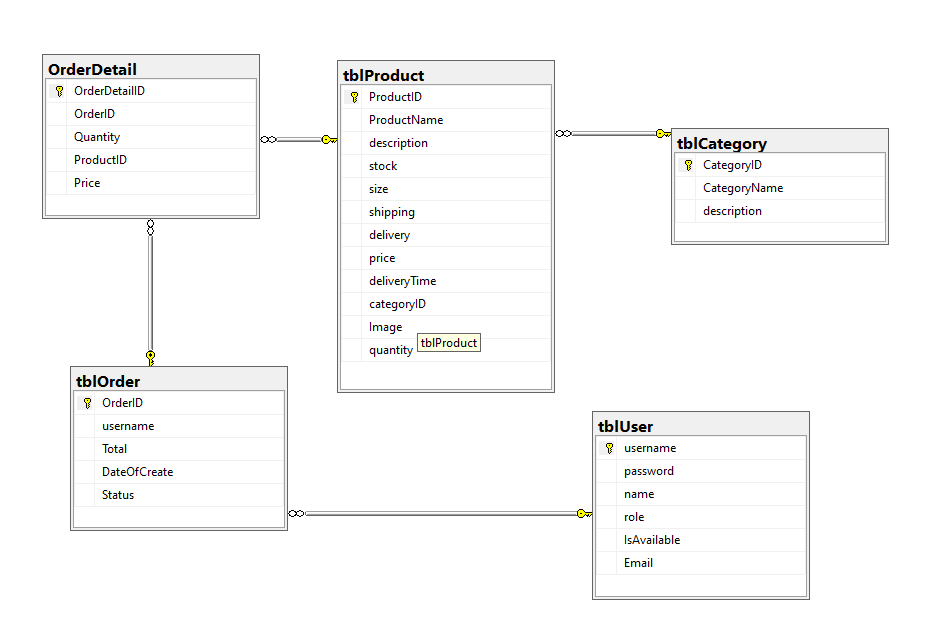

# Welcome to the Food Shop quick description (Indivitual Project)
## 1. Requirement

- Build a web site to manage foods and drinks
- There are 2 roles: Admin and User
- Admin can login; add, update, delete foods and drinks
- User can login; look up info of foods or drinks

## 2. Software, Language used:

- Netbeans 8.2 RC, SQL Server Management Studio
- Java, HTML, CSS, Javascript

## 3. Database (very simple): 

## 4. Feature:

- Responsive modified web template
- Easy to use user interface
- Upload image on adding new food or drink
